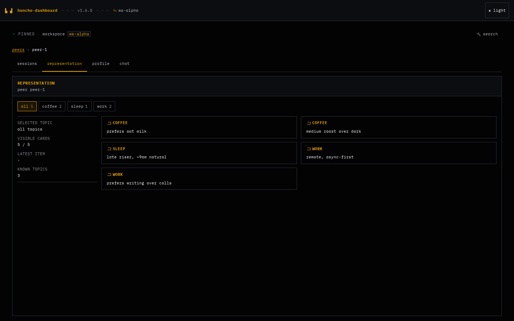

# honcho-dashboard

Self-hosted web dashboard for the OSS [Honcho](https://github.com/plastic-labs/honcho) server.

> Honcho ships an API-only OSS server. The first-party dashboard ("Honcho Chat") is closed-source and
> cloud-only. This repo provides a self-hostable inspector for operators running their own Honcho deployment.



The dashboard is an admin-facing inspection UI for Honcho's workspace, peer, session, representation, profile,
chat, and search APIs. It runs a small server-side proxy so the Honcho admin token stays on the server and never
lands in browser storage.

If `DASHBOARD_AUTH_MODE=password` is set, the dashboard uses a single-operator password gate backed by an
HTTP-only, SameSite session cookie. Keep `/healthz` public for probes. If dashboard auth is off, put the
service behind trusted network or reverse-proxy authentication before exposing it.

## Status

v1.6 is usable for self-hosted Honcho inspection. The dashboard is admin-facing; enable dashboard auth or
trusted reverse-proxy auth before exposing it outside an operator network. It is mostly read-only: session
messages, representation, profile, peers, workspaces, and search are inspection surfaces. The chat tab sends
natural-language queries to Honcho's dialectic endpoint and can cause Honcho to derive updated peer context,
but the dashboard does not edit or delete Honcho memories.

## Features

- Workspace picker mode, plus optional pinned-workspace mode via `HONCHO_WORKSPACE_ID`.
- Peer and session browser for drilling into Honcho's `workspace -> peer -> session -> message` hierarchy.
- Read-only message stream with older-page pagination.
- Per-peer representation view with topic chips and markdown-derived cards.
- Per-peer profile view with sanitized markdown rendering.
- Dialectic chat panel over Honcho's streaming `/peers/{peer_id}/chat` endpoint.
- Workspace semantic search with debounced query input and topic filtering.
- Optional shared-password dashboard auth with signed HTTP-only sessions.
- Browser-aware theme and English/German language detection, stored per browser.
- Font scale presets: small, normal, large, and extra large.
- Docker image, Docker Compose example, plain Kubernetes manifests, and Helm chart.

## Quickstart

```bash
docker run --rm -p 3000:3000 \
  -e HONCHO_API_BASE=https://your-honcho.example.com \
  -e HONCHO_ADMIN_TOKEN=your-admin-token \
  -e DASHBOARD_AUTH_MODE=password \
  -e DASHBOARD_AUTH_PASSWORD=choose-a-strong-operator-password \
  -e DASHBOARD_SESSION_SECRET=choose-a-long-random-session-secret \
  ghcr.io/iuliandita/honcho-dashboard:1.6.1
```

Open <http://localhost:3000>.

## Develop locally

```bash
bun install
bun run codegen
bun run dev
```

Set `HONCHO_API_BASE` and `HONCHO_ADMIN_TOKEN` in `.env` or your shell before starting the app.

## Testing

Use the package scripts, not Bun's native `bun test` discovery. This repo's tests rely on Vitest, Svelte
transforms, jsdom setup, and Playwright fixtures.

```bash
bun run check
bun run lint
bun run test
bun run test:e2e
```

## Configuration

| Env var | Required | Description |
|---|---|---|
| `HONCHO_API_BASE` | yes | Base URL of the Honcho API (e.g. `https://honcho.example.com`) |
| `HONCHO_ADMIN_TOKEN` | yes | Admin bearer token; never leaves the dashboard process |
| `HONCHO_WORKSPACE_ID` | no | If set, pins the dashboard to a single workspace |
| `DASHBOARD_AUTH_MODE` | no | `off` (default) or `password` |
| `DASHBOARD_AUTH_PASSWORD_HASH` | no | Preferred shared-password verifier for password mode |
| `DASHBOARD_AUTH_PASSWORD` | no | Plaintext shared password, accepted for simple deployments |
| `DASHBOARD_SESSION_SECRET` | password mode | Secret used to sign HTTP-only dashboard sessions |
| `DASHBOARD_SESSION_TTL_SECONDS` | no | Session lifetime in seconds. Default `43200`. |
| `DASHBOARD_SESSION_COOKIE` | no | Session cookie name. Default `honcho_dashboard_session`. |
| `PORT` | no | Listen port. Default `3000`. |
| `LOG_LEVEL` | no | `info` (default) or `debug`; `silent` is for tests |
| `HONCHO_PROXY_TIMEOUT` | no | Upstream timeout in seconds. Default `15`. |
| `BUILD_DIR` | no | Advanced override for the static build directory. Default `./build`. |

`docker-compose.yml` also requires `POSTGRES_PASSWORD` for its bundled Honcho/Postgres example.

Dashboard auth is intentionally a single shared operator password, not user accounts or RBAC. When enabled,
the Hono BFF protects proxied Honcho API requests and issues a signed, HTTP-only session cookie. Prefer
`DASHBOARD_AUTH_PASSWORD_HASH`; `DASHBOARD_AUTH_PASSWORD` is available for simple local or private installs.

Client preferences are stored in browser localStorage. Theme uses a stored override first, then browser
preference, with dark as the fallback. Language uses a stored override first, then browser language detection
for English or German, with English as the fallback. Font scale can be changed from the settings menu.

## Deploy

- Plain Kubernetes manifests: [`deploy/k8s/`](./deploy/k8s/)
- Helm chart: [`deploy/helm/honcho-dashboard/`](./deploy/helm/honcho-dashboard/)

Release image tags omit the leading `v`: use `ghcr.io/iuliandita/honcho-dashboard:1.6.1` for Git tag
`v1.6.1`.

## License

MIT. See [LICENSE](./LICENSE).
